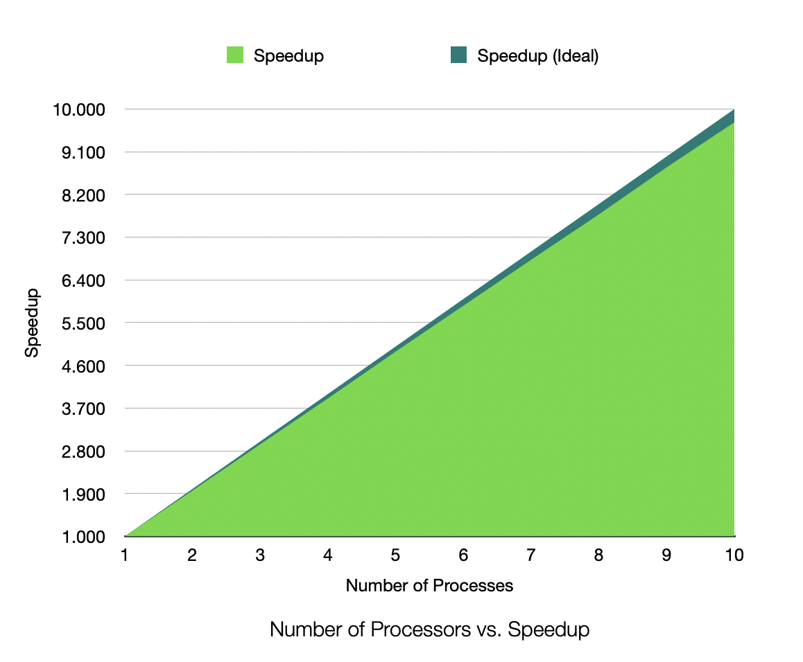
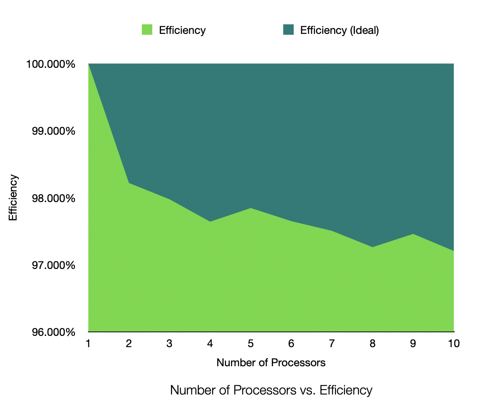
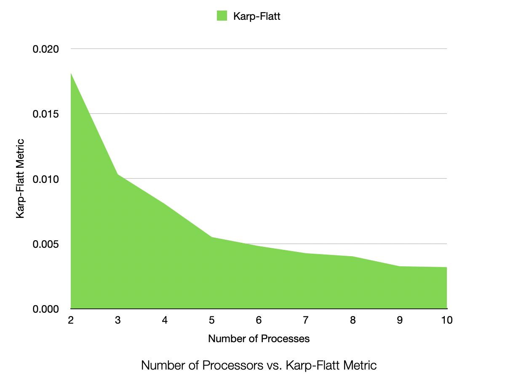
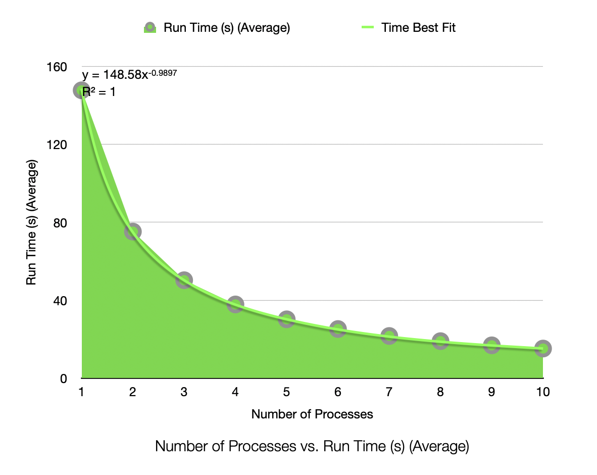
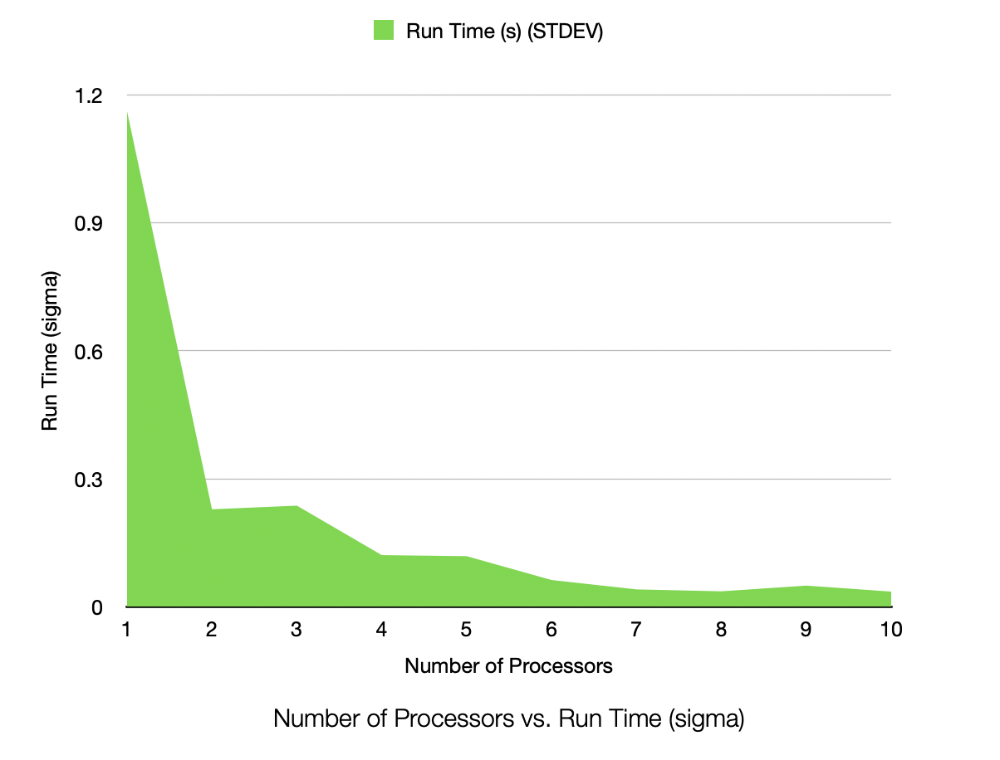

# MPI Assignment Report: Parallel K-Means Clustering

**Author:** Matthew Krueger
**Date:** October 17, 2022

---

## 1. Summary
This report describes the implementation and parallelization of K-Means Clustering using MPI, vs. serial execution.
I found that the parallel implementation had a near-linear speedup over the serial implementation, showing optimal
parallelism and optimal communication.
This shows that, at least for the problem sizes presented,
the parallel implementation as written here is a viable algorithm for parallel execution.

### 1.1 Algorithm Overview
K-Means Clustering is a popular clustering algorithm that is widely used in machine learning.
It is a method of unsupervised learning that aims to partition a set of data into a number of clusters,
where each data point is assigned to the cluster with the closest average (mean).
In effect, this algorithm finds groups of data points that are similar to each other.
In an iteration loop, the algorithm first finds to which previous cluster any given data point belongs.
From there, it calculates the average of all data points in *that cluster*, and this average is now the new "centroid."
This process is then repeated until convergence, or until a maximum number of iterations is reached.
Convergence is when the centroids are not changing significantly between iterations,
demarcated by a specified tolerance (epsilon).

---

## 2. Explanation of Design

### 2.1. Algorithm Choice and Serial Implementation

K-Means clustering (Lloyd's algorithm) was chosen for this assignment due to its popularity in big data analytics,
as well as its simplicity and ease of implementation.
K-Means can be written trivially in both serial and parall form, both of which were implemented for comparison.
Both the serial and parallel implementations are written in C++23 (preview) and validated to work with GCC 13.2.0.
However, you may have better luck on a more modern version of the compiler with full support for C++23.

C++23 was chosen for this assignemnt as it provides a variety of useful features that work together to save memory
and make the code read more functionally.
Tab-Autocomplete was used extensively throughout this assignment for help with functional design.
The list of features used includes:
*   `std::optional`
*   `std::variant`
*   `std::accumulate`
*   `std::ranges::accumulate`
*   `std::ranges::for_each`
*   `std::ranges::transform`
*   `std::ranges::view::iota`
*   `std::ranges::view::transform`
among others.

Specifically, these features were chosen due to their utility in regard to delayed explanation and optimization
for inline computation and auto vectorization.
Due to the way in which these functional features are implemented,
they rely on values being move constructable and largely contiguous in memory.
This allows for the compiler to perform optimizations that are otherwise impossible.
It also allows for Link Time Optimization (LTO) to optimize further in the final binary.
In doing this, the program execution time can be reduced significantly by utalizing the full power of the CPU.
On my M1 Pro Mac, this uses NEON instructions, and on the OSC cluster, it uses AVX512 instructions.

Importantly, these optimizations require the value to be move-constructable.
This uses the Named Return Value Optimization (NRVO) as well as Return Value Optimization (RVO)
 to avoid unnecessary copies of the data.
By default, the compiler will copy the data if it is not move-constructable,
which often leads to unnecessary copies and heap allocations.
In effect and from my research, the move semantics effectively tell the compiler "hey, if you're using this constructor,
we basically don't care about the old one."
In the end, it can be optimized away.
It is then a hint (or more accurately an instruction) to the compiler to *not* copy the data.
I relied on explicit copies of inner data, though with more care it may be possible to optimize the semantics
within the constraints of C++ to avoid unnecessary copies, while retaining semantic ease of use.

Boost was chosen for this project for its ease of use and integration with both CMake and MPI.
Boost.MPI was used for the parallel implementation, and Boost.Serialization was used to provide serialization
so that the data could be sent between processes.

I also implemented a profiler in Raw MPI. I had much of this code already written, but I had to re-implement it
for this project. I used the `MPI_Wtime` function to measure the time taken to run the program.

I also wrote a custom timer class.
Within an MPI context with the flag "BUILD WITH MPI" set, this timer class will use `MPI_Wtime` to measure the time.
Otherwise, it will use `std::chrono` to measure the time.
This was used to compare the performance of the serial and parallel implementations.
Timer uses proper SFINAE (Substitution Failure Is Not An Error) to determine how to run.
This timer is defined as such (shortened for brevity):
```c++
template<typename T>
TimeResult {
    T functionResult;
    uint64_t timeMicroseconds;
    inline uint64_t getTimeMilliseconds() const { return timeMicroseconds/1000UL; }
    inline uint64_t getTimeSeconds() const { return timeMicroseconds/1000000UL; }
    inline double getTimeSecondsDouble() const { return timeMicroseconds/static_cast<double>(1e6); }
};

template<typename FuncToTime>
std::enable_if_t<!std::is_void_v<std::invoke_result_t<FuncToTime>>, TimeResult<std::invoke_result_t<FuncToTime>>>
        time(FuncToTime toTime);
        
template<typename FuncToTime>        
std::enable_if_t<std::is_void_v<std::invoke_result_t<FuncToTime>>, TimeResult<void>>
        time(FuncToTime toTime);
```

This lets you call the timer with any function you want to time, and it will return the result of the function
along with the time taken to run the function.
For instance:
```c++
auto timeResult = time([&]{
    // do something that takes a long time
});
std::cout << "Time taken: " << timeResult.getTimeSecondsDouble() << " seconds" << std::endl;
```
If your function returns a value, it will automatically be placed in TimeResult<T>::functionResult.
If your function returns void, functionResult will not be present.

Other important design considerations include:
*   The `Point` class was designed to be move-constructable, and the `DataSet` class was designed to be move-constructable.
*   Copy constructors are disabled on most classes, requiring instead explicit copies of their data members.
*   Logging was done via a macro `DEBUG_LOG()` so it could be largely disabled.
*   For necessary logs, logging was done via if constexpr statements.
*   Many functions use views and then materialize them. This allows for memory savings as the values are not computed
    until materialization, leading to less memory usage overall, especially important for dataset generation or other
    data pipeline operations.

### 2.2. Parallelization Strategy

The operation was parallelized using MPI and Boost.MPI.
For data decomposition, I chose to use a simple data decomposition strategy where each process owns a subset of the data.
For example, if there are 10 processes, each process will own 1/10th of the data.
I did properly handle the case where the number of processes was not a multiple of the number of data points.
In this case, the remainder is distributed to processes 0 through r, where r is the remainder.
The data is distributed using a scatterv operation.
Upon each iteration, each process calculates the accumulator of each subset of the data.
Then, the local accumulator is Allreduce'd to a globally agreed upon accumulator using `boost::mpi::all_reduce`.
Each rank also Allreduce's the count of the centroids (though in this case count is a "hidden" attribute within
the `Point` class, allowing one all reduce operations with a single custom reduction functor to handle both cases).
From there, each rank divides each centroid by the count to get the new centroid.
This division is not done collectively as division is not associative, or commutative.
From there the process repeats.

### 2.3 Considerations for Parallelization

I attempted to discriminate based on what was "worth it" and what was not to parallize.
In a large dataset with a high K (number of clusters), the cost of division is likely to be much higher
and may benefit from problem partitioning. However, this would substantially increase the amount of
communication and setup time for the allreduce operaations and may not be worth it for K below a few thousand.

In lower dimensional spaces with many hundreds or thousands of K, it may be worth it to set up a K-D search space
that is able to prune the search space significantly.
However, in higher dimensional spaces, this may not be worth it, and without many hundreds of thousands of K,
the cost of setting up that data structure may not be worth it either.

I chose not to implement a K-D search space as it would be a significant amount of work and would not be worth the
benefit.

---

## 3. Benchmarking Details

### 3.1. Experiment Setup

I ran my experiment on the OSC (Ohio Supercomputing Center) Cerdinal Cluster.
Details of the hardware can be found [on their website](https://www.osc.edu/resources/technical_support/supercomputers/cardinal).
I did not request any specific hardware, only 10 processes distributed in whatever way the scheduler chose.
I used `openmpi/5.0.2`, `boost/1.83.0`, `cmake/3.25.2`, and `gcc/13.2.0`.
It should be noted that `gcc/13.2.0` only supports the preview version of C++23, and no other compiler supported
specific features I utalized, specifically zip views.

I ran each test a total of 10 times and reported the runtime of each run.
`srun` was invoked once per number of processes, and the number of processes was specified as a command line argument.
The script used to run the experiments is available in the root directory of this repository, called `benchmark.slurm`.

I regenerated the dataset from the same seed for each invocation of srun, but I did not regenerate the dataset for each
set of batches. This did not affect my result as I only timed the actual run of the K-Means algorithm, NOT of dataset
generation.

Each dataset was generated using the following parameters:
*   Number of samples: 1,000,000
*   Number of dimensions: 25
*   Number of clusters (K): 50
*   Dataset generation spread/characteristics: 3.5
*   Random seed used for reproducibility: 1234
*   Max iterations: 100,000
*   Default convergence threshold: 0.0001

Because of my timer, it detected it was running in an MPI context through CMake, and it used `MPI_Wtime` to measure
the time.
10 Trials were executed for each configuration (process count).

All statistical analysis was done on Apple Numbers, and is included in the `/Results` directory.

### 3.2. Benchmark Results

The results of the run are as follows:

#### 3.2.1. Results for 1000000 Samples, 25 Dimensions, 50 Clusters, Process Count 1-10
| Number Processes | Number Samples (Average) | Number Dimensions (Average) | Number Clusters (Average) | Spread (Average) | Seed (Average) | Run Time (s) (Average) | Run Time (s) (STDEV) | Iteration Count (Average) | Speedup | Efficiency | Karp-Flatt |
| :--------------- | :----------------------- | :-------------------------- | :------------------------ | :--------------- | :------------- | :--------------------- | :------------------- | :------------------------ | :------ | :--------- | :--------- |
| 1                | 1000000                  | 25                          | 50                        | 3.5              | 1234           | 147.6953               | 1.16058501052989     | 250                       | 1.000   | 100.000%   |            |
| 2                | 1000000                  | 25                          | 50                        | 3.5              | 1234           | 75.18676               | 0.228644552866574    | 250                       | 1.964   | 98.219%    | 0.018      |
| 3                | 1000000                  | 25                          | 50                        | 3.5              | 1234           | 50.24906               | 0.23718394268303     | 250                       | 2.939   | 97.975%    | 0.010      |
| 4                | 1000000                  | 25                          | 50                        | 3.5              | 1234           | 37.81581               | 0.121233635321776    | 250                       | 3.906   | 97.641%    | 0.008      |
| 5                | 1000000                  | 25                          | 50                        | 3.5              | 1234           | 30.18961               | 0.11871861643773     | 250                       | 4.892   | 97.845%    | 0.006      |
| 6                | 1000000                  | 25                          | 50                        | 3.5              | 1234           | 25.20847               | 0.0628473291220699   | 250                       | 5.859   | 97.649%    | 0.005      |
| 7                | 1000000                  | 25                          | 50                        | 3.5              | 1234           | 21.6393                | 0.040914762345366    | 250                       | 6.825   | 97.505%    | 0.004      |
| 8                | 1000000                  | 25                          | 50                        | 3.5              | 1234           | 18.98175               | 0.0363672089785412   | 250                       | 7.781   | 97.261%    | 0.004      |
| 9                | 1000000                  | 25                          | 50                        | 3.5              | 1234           | 16.8384                | 0.0497478307734786   | 250                       | 8.771   | 97.459%    | 0.003      |
| 10               | 1000000                  | 25                          | 50                        | 3.5              | 1234           | 15.1942                | 0.0357178589006178   | 250                       | 9.720   | 97.205%    | 0.003      |


#### Speedup for 1000000 Samples, 25 Dimensions, 50 Clusters, Process Count 1-10


#### Efficiency for 1000000 Samples, 25 Dimensions, 50 Clusters, Process Count 1-10


#### Karp-Flatt for 1000000 Samples, 25 Dimensions, 50 Clusters, Process Count 1-10


#### Run Time (Seconds) for 1000000 Samples, 25 Dimensions, 50 Clusters, Process Count 1-10


#### Run Time (Seconds, STDEV) for 1000000 Samples, 25 Dimensions, 50 Clusters, Process Count 1-10


### 3.3. Interpretation of Results

The speedup is very near linear, showing excellent parallelization.
The efficiency plot is very near to 100%, showing excellent scalability.
The Karp-Flatt metric is very close to 0, showing excellent parallel performance.
The runtime plot is very close-fitting to an exponential curve, further illustrating the excellent scalability.

Interestingly to me, the Karp-Flatt metric is actually approaching zero (and thus is showing a decrease in the
inherently sequential portion of the algorithm).
While I do not have an exact answer to this, I would suspect this is due to a very heavy GPU job running on the
cluster at the same time.
It was using over 600GB/s of bandwidth on infiniband, with all but 4 GPUs at 100% utilization.
This could cause some cache locality issues with fewer processes (taking longer to loop and thus invalidating cache).
It could have also been due to the HBM memory cache being able to keep my data entirely local in cache as per
rank dataset size decreased, decreasing latency for arithmatic options.
In other words, there was a heavy job going on in the cluster, and it may have affected it, or at least the cache
locality of the data, especially for larger datasets.

My data shows no real sign of a scaling limit approaching at this point in time as p increases.
However, as I mentioned, there may be some skew in this data due to the heavy job running on the cluster.
I had no other choice in cluster due to the availability of `gcc/13.2.0`.

In theory, there should have been no communication bottlenecks or load imbalance as the data is distributed evenly
across the processes, beside the aforementioned heavy job running on the cluster.

The design, which minimized MPI communication except for one synchronized all_reduce, effectively reduced the amount of
work that any given rank needed to perform, and made the only real serial time the time spent waiting for synchronization
of the all_reduce.

---

## 4. Verification

### 4.1. Correctness Strategy

Unfortunately, I did not have time to add an automated verification strategy to this assignment.
I did compare the verification by hand, and the list of centroids was identical (minus floating point differences)
on my local machine for all values of `p` I tested.

For early termination, I used the Euclidean distance the current iteration of centroids and the previous iteration of
centroids.
If the distance was less than the convergence threshold, I terminated early.
This does not need to be a fancy algorithm as label switching should only happen on initial centroid selection.
If there are unclear labels or any sort of label switching earlier on in execution,
the whole point is that it is not converged at that time and should continue anyway.

## 4.2 Future Verification Strategy and Methods

For the future, I would like to add automated verification.
My ideal verification would be to run the Hungarian algorithm on the centroids and compare the results.
Since I have "ground truth" data for the center of the clusters (but not necessarily their centroids themselves),
I need to correct any label switching that occurs.
Then, we can take the maximum Euclidean distance between the two sets of (now paired) centroids, who had their global
cost minimized through the Hungarian algorithm.
This becomes a driver for a similarity score, allowing us to compare the results of the parallel and sequential
implementations. If the maximum distance of the paired points is very different (when run on an **IDENTICAL**) dataset,
then we know that the parallel and sequential implementations are not equivalent.
Through my manual testing I do know that they are equivalent, but I would like to automate this verification as well.

When I performed my manual checks on a smaller dataset, I received the same sets of centroids.
Running the serial `p=1` vs parallel `p=10` on my local machine with reduced parameter count:
`--max-iterations 100000 --num-samples 100000 --dimensions 3 --clusters 10 --spread 3.5 --trials 1`
yelled these results for `p=1` and `p=10` with the DEBUG_FLAG overridden in main.cpp:

```terminaloutput
mckrueg@Matthews-MacBook-Pro cmake-build-debug % mpiexec -n 1 ./kmeans_mpi --max-iterations 100000 --num-samples 100000 --dimensions 3 --clusters 10 --spread 3.5 --trials 1

Known Good Centroids:
        Point: (22668,47979.2,66262.2)
        Point: (38115.9,36405.6,58620.5)
        Point: (48770.2,33666.7,-29679)
        Point: (43568.5,50359.4,-59226.1)
        Point: (26191.8,25562.7,-9607.56)
        Point: (8152.51,27913.7,-47470)
        Point: (54788.4,36943.7,-68192.5)
        Point: (47713.3,50874.8,68768.3)
        Point: (320.971,22865.4,-36587.4)
        Point: (51269.9,41025.3,-44354.5)
1,100000,3,10,3.5,1234,0.442583,yes,116,0
Calculated Centroids:
        Point: (4236.73,25389.6,-42028.7)
        Point: (48770.3,33666.8,-29679.1)
        Point: (42914.6,43640.2,63694.4)
        Point: (54786.1,36944.9,-68193.8)
        Point: (51270,41025.3,-44354.5)
        Point: (22666.1,47978.2,66260.4)
        Point: (26191.7,25562.7,-9607.53)
        Point: (22669.8,47980.3,66264)
        Point: (43568.5,50359.4,-59226.1)
        Point: (54790.6,36942.6,-68191.3)
mckrueg@Matthews-MacBook-Pro cmake-build-debug % mpiexec -n 10 ./kmeans_mpi --max-iterations 100000 --num-samples 100000 --dimensions 3 --clusters 10 --spread 3.5 --trials 1

Known Good Centroids:
        Point: (22668,47979.2,66262.2)
        Point: (38115.9,36405.6,58620.5)
        Point: (48770.2,33666.7,-29679)
        Point: (43568.5,50359.4,-59226.1)
        Point: (26191.8,25562.7,-9607.56)
        Point: (8152.51,27913.7,-47470)
        Point: (54788.4,36943.7,-68192.5)
        Point: (47713.3,50874.8,68768.3)
        Point: (320.971,22865.4,-36587.4)
        Point: (51269.9,41025.3,-44354.5)
10,100000,3,10,3.5,1234,0.159717,yes,116,0
Calculated Centroids:
        Point: (4236.73,25389.6,-42028.7)
        Point: (48770.3,33666.8,-29679.1)
        Point: (42914.6,43640.2,63694.4)
        Point: (54786.1,36944.9,-68193.8)
        Point: (51270,41025.3,-44354.5)
        Point: (22666.1,47978.2,66260.4)
        Point: (26191.7,25562.7,-9607.53)
        Point: (22669.8,47980.3,66264)
        Point: (43568.5,50359.4,-59226.1)
        Point: (54790.6,36942.6,-68191.3)
```

---

## 5. Reflection

### 5.1. Learning Experience

I learned that while a problem appears simple on the surface, it may be more complex than you think.
For example, K-Means is a basic algorithm and relatively trivial to parallize.
However, the specific details of the operations are very detailed and require careful thought and planning.

I also learned that C++23 does make life easier, but it does come at a cost of complexity.
Much of the pipeline code I wrote is substantially longer than it would be if I had done it the old fashioned way.
However, in the end result, it often yeilds a more performant result.

I did also learn that the C++23 features are **NOT** a silver bullet capable of solving all problems.
I had several places in my code where the fancy C++23 features
were actually substantially slower than direct C++17 code.
In these cases, I had to remove them and use regular loops instead.

I was able to gain this insight through my profiling system, which gives me detailed timing information for
every level of the call stack.

I also learned that Boost.MPI is a very powerful library, and avoiding manually flattening of points prevents
substantial errors that caused various types of heap corruption.
For instance, I had one bug while attempting to remove the functor (as boost.MPI::all_reduce has some weird performance
implications when using a custom reduction functor), but any time I attempted to copy data into `m_CurrentCentroids`,
I was unable to do so without having a segmentation fault. I was even able to copy the data several times before that,
but as soon as it went into m_CurrentCentroids, it faulted out.

I believe most aspects were done pretty well, but I do wish I had a bit more time to go through and organize the code a
bit better.

### 5.2. Trade-offs

I did not really have any *specific* trade-offs to make.
The closest thing was that I had to use the pipeline system to generate the dataset, as not doing so was unsustainable
on my machine due to limited memory.
While this would have been fine on OSC, I really wanted this program to be runnable on my local machine for
ease of development.

### 5.3. Advice for Future Students

I would advise making heavy use of timers and profiling to be able to understand the detailed implications of your code.
I would also heavily advise the heavy use of modern C++ functions, as well as auto vectorization optimizations
to speed up computations to the maximum extent possible.

---

## 6. Deliverables (Checklist)

*   [X] Code (Serial and Parallel versions)
*   [X] Build system (`CMakeLists.txt`)
*   [X] SLURM scripts for OSC
*   [X] Benchmark data (CSV in `/Results` directory)
*   [X] LLM Transcripts (Linked in `README.md` or included in `/Transcripts` directory)
*   [X] `README.md` (This report, following the specified sections)

---

Report Template generated by Gemini 2.5 Flash (thinking). Transcript included.